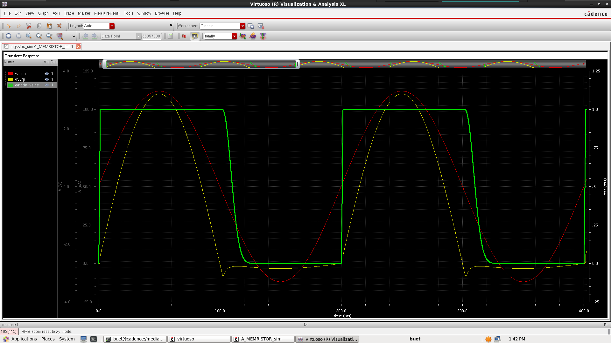
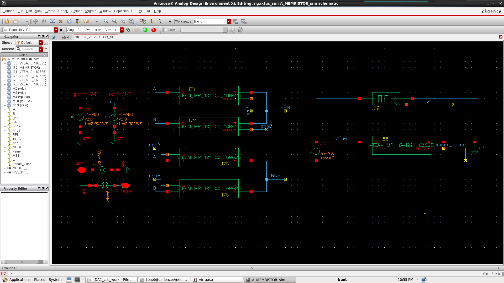
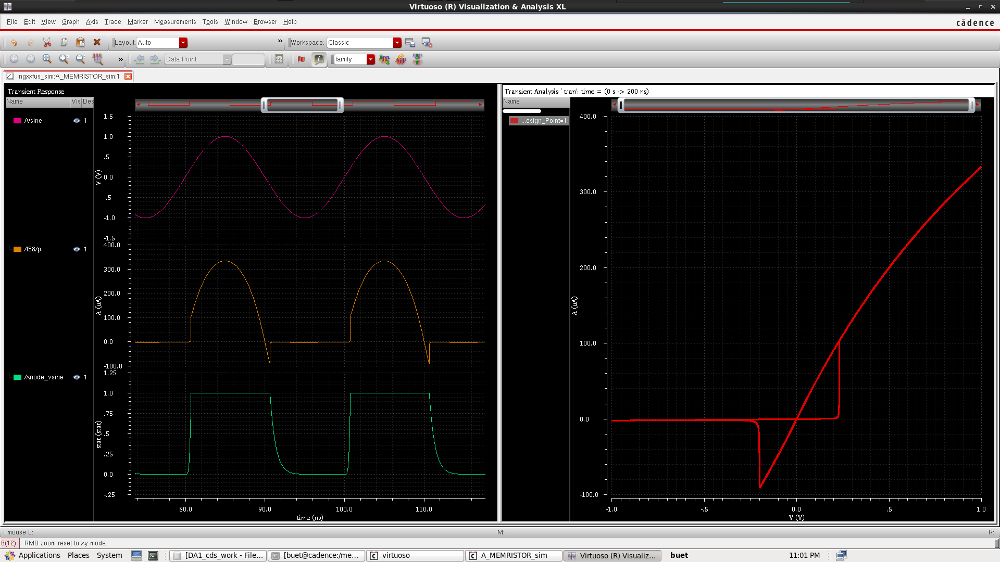

# About

This V-VTEAM memristor model is desribed via Verilog-A based on the model on the report [1].  

# VerilogA code (latest)

```VerilogAMS
`include "constants.vams"
`include "disciplines.vams"

/// Define a new unit for x-state
nature state
    access = stat;
    units = "x1";
    abstol = 1u;
endnature

discipline state_disc
    potential state;
enddiscipline

/// Manual integration of state variable
`include "constants.vams"
`include "disciplines.vams"

/// Define a new unit for x-state
nature state
    access = stat;
    units = "x1";
    abstol = 1u;
endnature

discipline state_disc
    potential state;
enddiscipline

/// Manual integration of state variable
module memristor(p, n, xnode);
    inout p, n;
    electrical p, n;

    output xnode;
    state_disc xnode;

    /// Parameters for the VVTEAM memristor model
    parameter real Xon   = 1;
    parameter real Xoff  = 0;
    parameter real Xinit = 0.5;
    parameter real Vth   = 0.02;
    parameter real Vh    = -0.2;
    parameter real Ron   = 2K;
    parameter real Roff  = 5M;
    parameter real k     = 5e7;
    parameter real alpha = 3;
    parameter real beta  = 1;
    parameter real tau   = 56p;
    parameter real Imax  = 3.5m;

    /// User must specify dt same as max step size in
    /// transient analysis & must be at least 3 orders
    /// smaller than T period of the source
    /// dt = 0, auto compute via t_last_compute;
    parameter real dt = 0;

    /// Approx Zero
    parameter approx_zero = 15a;

    /// Local variables
    real x, dxdt, t_decay, eqiv_res, I_calc;
    real delta_t, t_last_compute;

	analog function real soft_bounded;
		input __value, __max_absolute;
		real  __value, __max_absolute;
		begin
			soft_bounded = __max_absolute*tanh(__value/__max_absolute);
		end
	endfunction

    analog function real bounded;
        input __value, __lower, __upper;
        real __value, __lower, __upper;
        if (__value < __lower)
            bounded = __lower;
        else if (__value > __upper)
            bounded = __upper;
        else
            bounded = __value;
    endfunction

    analog function real dxdt_decay;
        input   __t;    input __x;
        real    __t;    real  __x;

        begin
            if (__t > approx_zero)
                dxdt_decay = (-1 * __x * beta * pow(__t / tau, beta - 1) / tau);
            else
                dxdt_decay = 0;
        end
    endfunction

    analog function real dxdt_growth;
        input __Vpn; real __Vpn;
        real __base;
        begin
            __base = (__Vpn / Vth) - 1;
            if(__base > approx_zero)
                dxdt_growth = k * pow(__base, alpha);
            else
                dxdt_growth = 0;
        end
    endfunction

    analog begin
        /// Initialize state at simulation start
        @(initial_step) begin
            x = Xinit;
            t_decay = 0;
            delta_t = 0;
            t_last_compute = $abstime;
        end

        /// Update delta_t
        if( dt < approx_zero ) begin
            /// Compute delta_t
            delta_t = $abstime - t_last_compute;
            /// Saved current time
            t_last_compute = $abstime;
        end else begin
            delta_t = dt;
        end

        /// Update dx/dt based on input voltage
        if (V(p, n) < Vh) begin
            t_decay = t_decay + delta_t;
            dxdt = dxdt_decay(t_decay, x);
        end else begin
            t_decay = 0;
            if (V(p, n) > Vth) begin
                dxdt = dxdt_growth(V(p, n));
                t_decay = 0;
            end else begin
                dxdt = 0;
            end
        end

        /// Manually integrate to update x
        x = bounded(x + dxdt * delta_t, Xoff, Xon);
        
        /// Update resistance
        eqiv_res = (Ron + (((Roff - Ron) / (Xoff - Xon)) * (x - Xon)));
        
        /// Compute current and update 
		I(p,n) <+ soft_bounded(V(p, n) / eqiv_res, Imax);;

        /// Update xnode
        stat(xnode) <+ x;

    end

endmodule

```


# Simulation

## Set-up
- Simulator: Spectre
- Time-step: The time step \<dt\> same to the max-step and must be at least 3 orders smaller than T period of the source.
- UserCommand (ADE/Cadence Virtuoso): `-ac 0`

# Result

## Waveform with tau=10m



## Fitting to VTEAM






# Version notes

- "old_memristor_model.va" - Old model from [https://asic2.group](https://asic2.group/wp-content/uploads/2017/09/memristor-model.txt).
- "vteam-memristor-25.06.12.18.36.00.va" - New model based on the report [1]; Using Euler's approximate to compute `x` from `dx`; W/o current bounding.
- "vteam-memristor-25.06.14.17.35.00.va" - New model based on the report [1]; Supposed that V(t) is const function, then determine `x` from `dx`; W/o current bounding.
- "vteam-memristor-25.06.14.22.23.00.va" - New model based on the report [1]; Back to use Euler's approximate to compute `x` from `dx`; With current bounding.
- "vteam-memristor-25.06.16.10.41.00.va" New model based on the report [1]; Using Euler's approximate to compute `x` from `dx`; With current bounding. And W/O specify the dt (will auto compute `delta_t = $abstime - t_last_compute`).

# References

[1] T. Patni, R. Daniels, and S. Kvatinsky, “V-VTEAM: A Compact Behavioral Model for Volatile Memristors,” 2024 International Flexible Electronics Technology Conference (IFETC), 2024, pp. 1–4, doi: 10.1109/IFETC61155.2024.10771870.
