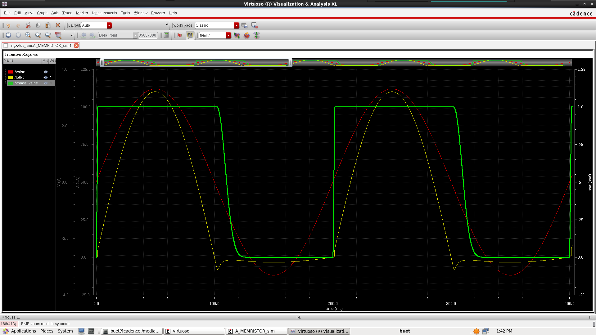

# About

This V-VTEAM memristor model is desribed via Verilog-A based on the model on the report [1].  

# VerilogA code

```VerilogAMS
    `include "constants.vams"
    `include "disciplines.vams"

    /// Define a new unit for x-state
    nature state
        access = stat;
        units = "x1";
        abstol = 1u;
    endnature

    discipline state_disc
        potential state;
    enddiscipline

    /// Manual integration of state variable
    module memristor(p, n, xnode);
        inout p, n;
        electrical p, n;

        output xnode;
        state_disc xnode;

        /// Parameters for the VVTEAM memristor model
        parameter real Xon   = 1;
        parameter real Xoff  = 0;
        parameter real Xinit = 0.5;
        parameter real Vth   = 1.744;
        parameter real Vh    = 1.5726;
        parameter real Ron   = 30k;
        parameter real Roff  = 15G;
        parameter real k     = 650;
        parameter real alpha = 0.099999;
        parameter real tau   = 1.0444;
        parameter real beta  = 2.14262;
        parameter real Ipn_max  = 3.5u;
        parameter real Inp_max  = 3.5u;

        /// User must specify dt same as max step size in
        /// transient analysis & must be at least 3 orders
        /// smaller than T period of the source
        parameter real dt = 1e-10;

        /// Local variables
        real x, dxdt, t_decay, eqiv_res, I_calc;

        analog function real bounded;
            input __value, __lower, __upper;
            real __value, __lower, __upper;
            if (__value < __lower)
                bounded = __lower;
            else if (__value > __upper)
                bounded = __upper;
            else
                bounded = __value;
        endfunction

        analog function real dxdt_decay;
            input   __t;    input __x;
            real    __t;    real  __x;

            begin
                if (__t > 0)
                    dxdt_decay = (-1 * __x * beta * pow(__t / tau, beta - 1) / tau);
                else
                    dxdt_decay = 0;
            end
        endfunction

        analog function real dxdt_growth;
            input __Vpn; real __Vpn;
            dxdt_growth = k * pow((__Vpn / Vth) - 1, alpha);
        endfunction

        analog begin
            /// Initialize state at simulation start
            @(initial_step) begin
                x = Xinit;
                t_decay = 0;
            end

            /// Update dx/dt based on input voltage
            if (V(p, n) < Vh) begin
                t_decay = t_decay + dt;
                dxdt = dxdt_decay(t_decay, x);
            end else begin
                t_decay = 0;
                if (V(p, n) > Vth) begin
                    dxdt = dxdt_growth(V(p, n));
                    t_decay = 0;
                end else begin
                    dxdt = 0;
                end
            end

            /// Manually integrate to update x
            x = bounded(x + dxdt * dt, Xoff, Xon);
            
            /// Update resistance
            eqiv_res = (Ron + (((Roff - Ron) / (Xoff - Xon)) * (x - Xon)));
            
            /// Compute current and update current
            I_calc   = bounded((V(p, n)/eqiv_res), -Inp_max, Ipn_max);
            I(p,n) <+ I_calc;

            /// Update xnode
            stat(xnode) <+ x;

        end

    endmodule

```


# Simulation

## Set-up
- Simulator: Spectre
- Time-step: The time step \<dt\> same to the max-step and must be at least 3 orders smaller than T period of the source.
- UserCommand (ADE/Cadence Virtuoso): `-ac 0`

## Model's params

- Ron       : 30K
- Roff      : 1M
- Vth       : -0.2
- Vh        : 0.02
- alpha     : 0.099999
- beta      : 2.14262
- tau       : 10m           (s)
- k         : 650
- Xon       : 1
- Xoff      : 0
- Xinit     : 0
- Ipn_max   : 1             (A)
- Inp_max   : 1             (A)
- dt        : 0.0001/F      (s)

# Result

## Waveform with tau=10m


## 

# Version notes

- "old_memristor_model.va" - Old model from [https://asic2.group](https://asic2.group/wp-content/uploads/2017/09/memristor-model.txt).
- "vteam-memristor-25.06.12.18.36.00.va" - New model based on the report [1]; Using Euler's approximate to compute `x` from `dx`; W/o current bounding.
- "vteam-memristor-25.06.14.17.35.00.va" - New model based on the report [1]; Supposed that V(t) is const function, then determine `x` from `dx`; W/o current bounding.
- "vteam-memristor-25.06.14.22.23.00.va" - New model based on the report [1]; Back to use Euler's approximate to compute `x` from `dx`; With current bounding.

# References

[1] T. Patni, R. Daniels, and S. Kvatinsky, “V-VTEAM: A Compact Behavioral Model for Volatile Memristors,” 2024 International Flexible Electronics Technology Conference (IFETC), 2024, pp. 1–4, doi: 10.1109/IFETC61155.2024.10771870.
